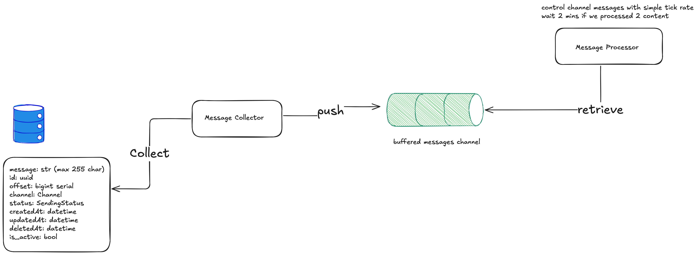

# ULAK - Automatic Message Sender

A high-performance message delivery system built in Go, demonstrating advanced concurrency patterns and distributed system design principles.

## Table of Contents
- [Introduction](#introduction)
- [Architecture](#architecture)
- [Features](#features)
- [Getting Started](#getting-started)
- [Design Decisions](#design-decisions)
- [Trade-offs](#trade-offs)
- [Production Considerations](#production-considerations)
- [Project Structure](#project-structure)
- [AI Usage](#ai-usage)

## Introduction

ULAK is an automatic message delivery system that showcases proficiency in Go concurrency patterns and distributed system design.
This implementation avoids using traditional message queue solutions (Kafka, RabbitMQ, Redis Queue) to demonstrate low-level understanding of concurrent systems and custom queue implementations.

## Architecture

### Worker Structure



The system uses a pull-based architecture where a populator component fetches messages from PostgreSQL and distributes them to a processor worker via a buffered channel.


### Components

- **Populator Worker**: Singleton worker that pulls pending messages from PostgreSQL  with backpressure control
- **Processor Worker**: Single worker (it can scale up) that consumes messages from a channel with rate limiting (default: 1 msg/minute)
- **Worker Manager**: Orchestrates lifecycle of both workers with graceful shutdown support
- **PostgreSQL Store**: Primary persistent storage for messages with GORM-based CRUD operations and transaction support
- **Notification Service**: Webhook-based notification delivery system
- **HTTP API**: REST endpoints for controlling auto-send and retrieving sent messages

## Features

- Rate-limited message processing (configurable messages per minute)
- Backpressure mechanism with channel occupancy checking
- Graceful shutdown with configurable timeouts
- Message persistence and crash resilience via PostgreSQL
- Offset-based message fetching for reliable message tracking
- Singleton populator pattern prevents duplicate message fetching

## Getting Started

### Prerequisites

- Go 1.23 or higher
- PostgreSQL 14+ or Redis 7+
- Docker (optional, for containerized deployment)

### Installation

```bash
# Clone the repository
git clone git@github.com:iamnotagentleman/ulak.git  
cd ulak

# Install dependencies
go mod download

# Build the application
go build -o ulak ./cmd/ulak


# Docker
docker compose build
```

### Running

```bash
# Run the application
./ulak

# Or with Docker
docker-compose up -d
```

### Testing


#### Run All Tests

```bash
# Run all tests
go test ./...

# Run tests with coverage
go test ./... -cover

# Run tests with detailed output
go test ./... -v

# Run tests with coverage report
go test ./... -coverprofile=coverage.out
go tool cover -html=coverage.out
```

### API Endpoints

#### Start/Stop Auto-Send

```bash
# Start automatic message sending
curl -X POST http://localhost:8080/messages/auto-send \
  -H "Content-Type: application/json" \
  -d '{"action": "start"}'

# Stop automatic message sending
curl -X POST http://localhost:8080/messages/auto-send \
  -H "Content-Type: application/json" \
  -d '{"action": "stop"}'
```

#### Retrieve Sent Messages

```bash
# Get all sent messages
curl http://localhost:8080/messages/sent
```

Response format:
```json
{
  "messages": [
    {
      "id": "uuid",
      "to": "recipient",
      "message": "content",
      "channel": "WEBHOOK",
      "status": "SENT",
      "created_at": "timestamp",
      "updated_at": "timestamp"
    }
  ]
}
```

## Design Decisions

### Pull-Based Message Queue

The populator implements a pull-based messaging pattern similar to Kafka consumers:

**Pros**
- **Simplicity**: Monolithic structure that's easy to deploy and understand
- **Persistence**: Messages survive crashes and can be replayed
- **Backpressure**: Natural flow control prevents overwhelming downstream systems
- **Single Producer Reliability**: Works excellently for single-instance deployments

**Cons:**
- **Scalability**: Single populator per data source (horizontal scaling requires partitioning)
- **Complexity**: Custom implementation increases code complexity vs. using established message queues
- **Limited Error Handling**: Dead letter queue patterns need manual implementation

### Why No Message Queue?

This was a deliberate architectural choice to demonstrate:
1. Deep understanding of concurrency primitives
2. Ability to implement distributed patterns from scratch
3. Problem-solving without relying on external dependencies

In production systems, using Kafka or RabbitMQ would be recommended for better scalability and operational maturity.

## Trade-offs

### Current Implementation

| Aspect | Trade-off |
|--------|-----------|
| **Scalability** | Single producer limitation vs. simplicity |
| **Complexity** | Custom queue logic vs. using battle-tested solutions |
| **Operational Overhead** | Self-managed vs. leveraging message queue ecosystems |

### Scaling Considerations

To scale the current implementation:

1. **PostgreSQL Partitioning**: Partition the messages table by range or hash
   - See: [PostgreSQL Partitioning Documentation](https://www.postgresql.org/docs/current/ddl-partitioning.html)
   - Deploy one populator per partition
   - Each partition acts as an independent queue

2. **Database Sharding**: Distribute messages across multiple databases

## Production Considerations

For a production-ready system, I would recommend:

### Message Queue Integration

- **Kafka** for distributed message streaming
  - Horizontal scalability through partitioning
  - Native support for consumer groups
  - Built-in replication and fault tolerance
  - Rich ecosystem of connectors and tools

### Enhanced Reliability

- **Dead Letter Queue (DLQ)**: Handle failed messages separately
- **Retry Policies**: Exponential backoff with jitter
- **Circuit Breakers**: Prevent cascading failures
- **Idempotency**: Ensure message processing is idempotent


### Observability

- **Metrics**: Prometheus/Grafana for monitoring
- **Tracing**: OpenTelemetry for distributed tracing
- **Logging**: Structured logs with correlation IDs

## Project Structure

```
ulak/
├── cmd/
│   └── main.go                     # Application entry point
├── internal/
│   ├── apierror/                   # Error handling
│   │   ├── apierror.go             # API error types
│   ├── config/                     # Configuration management
│   ├── handlers/                   # HTTP handlers
│   │   ├── url.go                  # REST API endpoints
│   ├── manager/                    # Worker lifecycle management
│   │   ├── manager.go              # Worker manager implementation
│   │   └── manager_test.go         # Manager tests
│   ├── middleware/                 # HTTP middleware
│   │   ├── auth.go                 # API key authentication
│   │   └── auth_test.go            # Auth tests
│   ├── service/                    # Business logic layer
│   │   ├── service.go              # Service interface
│   │   ├── message.go              # Message service
│   │   └── service_test.go         # Service tests
│   ├── store/                      # Data persistence layer
│   │   ├── postgres/               # PostgreSQL implementation
│   │   │   ├── store.go            # CRUD operations
│   │   │   └── validation_test.go  # Validation tests
│   │   └── redis/                  # Redis cache implementation
│   │       └── store.go            # Key-value operations
│   ├── testing/                    # Test utilities
│   │   ├── mocks.go                # Mock implementations
│   │   └── helpers.go              # Test helpers
│   └── worker/                     # Worker implementations
│       ├── populator/              # Message fetching worker
│       │   ├── populator.go        # Singleton populator
│       │   └── populator_test.go   # Populator tests
│       └── processor/              # Message processing worker
│           ├── processor.go        # Rate-limited processor
│           └── processor_test.go   # Processor tests
├── pkg/
│   └── notification/               # Notification delivery
│       └── notification.go         # Webhook sender interface
└── README.md
```

## AI Usage

For this assignment, I was informed that heavily LLM usage prohibited.
I designed the core infrastructure and did most of the coding myself, but in a few areas I received help from Claude:

- Logging Enhancement: To add some external info to logs, I asked Claude to include additional details.
- Grammar Correction: Some comments were improved by an LLM to fix my grammar issues.
- GoDoc Generation for Swagger: You will see simple GoDoc comments in the services and cmd/main.go; I asked Claude to add details there.
- Data Faker Code: A simple script to create example records.
- Tests: Mock clients and some implementations written by claude
- README.md: I wrote the initial draft of this file, which Claude later helped improve.

As you can see, the assistance was limited to repetitive tasks or simple scripting.